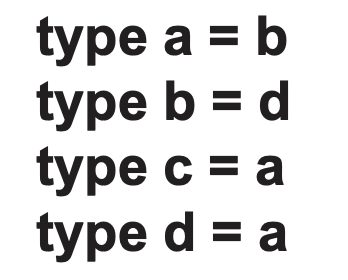
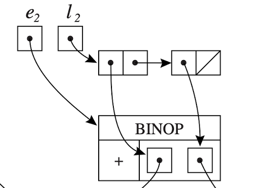

# 前言

成绩组成


# Ch.2 Lexical Analysis

## Intro

- **前端：Analysis 一般源语言有关而目标机无关**
  - **Lexical 词法分析**
    - 输入源码字符串
    - 将字符串分离为Tokens
      - Token包括保留字、变量名、符号和字面量等等程序正文内容
      - Non-Token包括注释、编译命令和宏、Tab和空行等
  - Syntax 语法分析
  - Semantic 语义分析
- 后端：目标机相关

本节关注词汇分析，比如对目标程序

```c
float match0(char *s) /* find a zero */ {
  if (!strncmp(s, "0.0", 3))
    return 0.; 
}
```

可以分为如下Token

```
FLOAT ID(match0) LPAREN CHAR STAR ID(s) RPAREN
LBRACE IF LPAREN BANG ID(strncmp) LPAREN ID(s)
COMMA STRING(0.0) COMMA NUM(3) RPAREN RPAREN 
RETURN REAL(0.0) SEMI RBRACE EOF
```

为了方便的表达与区分Token，我们一般使用Regular Expression和Finite Automata。

## Regular Expression

只保留了与计算理论有区别的部分。

#### Abbreviations

- [a-g] = [abcdefg]
- [a-cA-d] = [abcABCD]
  - 注意“区间”要区分大小写，形如[a-A]是非法的
- a? = (a|) =  (a|$\epsilon$) = a or nothing
  - 在这本书里空串用$\epsilon$表示

#### 正则语言的歧义性

当语法有歧义时，比如`if8`是if与8两者还是if8整体，我们一般使用如下规则：

- **Longest match:** The longest initial substring of the input that can match any regular expression is taken as the next token.
- **Rule priority:** For a *particular* longest initial substring, the first regular expression that can match determines its token type. This means that the order of writing down the regular-expression rules has significance.

## Finite Automata

只说与计算理论有区别的部分。

可以不把所有的边都画出来，只进不出的死状态和其边可以不画。在转移条件上可以适当的用自然语言描述，表意清晰即可。

**从NFA构造DFA的方法**同计算理论，这里给出了伪代码，要看懂。


## Optimize DFA

DFA经常可以优化，减少状态总数。

当两个状态向其他状态转移的条件完全相同时，他们可以合并。但这并不充分，比如下面这个例子：


# CH.3 Syntax Analysis


## Intro

- **前端：Analysis 一般源语言有关而目标机无关**
  - Lexical 词法分析
  - **Syntax 语法分析**
    - 输入是token流
    - 分析token的排列（即语法，Syntax只与书写格式有关，与具体逻辑无关）是否符合语言规则
    - 最终生成抽象的语法树
  - Semantic 语义分析
- 后端：目标机相关

因为Syntax不关心内部逻辑，只检查各个局部的格式规范，自然的想到可以使用CFG。例如对下述语言格式（已经用CFG文法来表示）：


检查某段代码是否符合上面语言的语法：


即判断/推导这个串能否由这个CFG文法生成：


## Derivation

- **最左/最右推导**
  - 总是对最左/最右侧非终结符应用文法规则的推导
  - **最左推导称自顶向下**
  - **最右推导称自底向上**
- **EOF**
  - 众所周知一段计算机文本以EOF结尾，一般用\$表示
  - 为了正确的生成这个特定的结束符，编译用CFG一般适当改造起始符
  - 
  - 其中S是原起始符，新增S‘状态以确保生成EOF在末尾
- **语法树**
  - Concrete (Parse) Syntax Tree: 计算理论概念上的语法树，完整包含每一个细节
  - Abstract Syntax Tree: 抽象语法树，省略部分计算机不关心的信息

## Ambiguity

如果CFG的生成树不一定是唯一的，称它为Ambiguous Grammars歧义文法，比如：


要证明一个CFG是歧义的，只需要找到一个串，证明存在至少两种不同的推导可以得到它。

编程语言不接受二义性，所以对歧义文法需要添加额外的规则。除了直接描述规则（比如yacc），还可以用更数学的办法：改造CFG。比如下面这个文法，实现了乘除优先于加减：离根节点越近，优先级越低。


## Recursive Descent Parsing

### LL(K)分析

**自顶向下（最左推导）的语法分析。**

- Parse many, but **not all CFGs**
- Key ideas
  - 正向使用CFG的文法，从初始状态开始尝试生成输入
    - 联系PDA的工作过程，一边生成一边比对输入，相同则消耗
    - 程序上终结符（即token，不会再发生推导）消耗，非终结符**递归向下**

下面以**LL(1)** （L.eft-to-right; L.eft-most; 1 symbol lookahead）为例，注意观察一个case如何对应一条文法生成规则。


### 分析表

#### 补充信息

- **Nullable**
  - 当且仅当非终结符X可以生成空串时，称X为Nullable可空的
  - 如果X = ABCD...，那么当且仅当ABCD...都是Nullable时X是Nullable的
- **First(X)**
  - 字符X可生成的所有串中，开头的终结符**以及Epsilon（如果Nullable）**的集合
  - 找First的方式是，对所有基于X的推导$X\rightarrow\alpha Y$
      - 如果$\alpha$是终结符，$First(X)$+=$\alpha$
      - 如果$\alpha$是非终结符，$First(X)$+=$First(\alpha)$
- **Follow(X)**
  - 其他非终结符推导生成的所有含X的串中，**紧跟在X之后**的非终结符的集合
  - 找Follow的方式是，对所有可以生成X的文法$S\rightarrow\alpha X \beta$
      - $Follow(X)$+=$First(\beta)$
      - 如果$\beta$可空，或者$\beta$不存在X就是生成串的末尾，再做$Follow(X)$+=$Follow(S)$

对任意CFG，上面三者可以通过计算机程序枚举计算：


举个例子：


#### 生成分析表

有了上面这张表，我们就可以得到**分析表**。分析表中每一个非终结符占一行，每一个终结符占一列；[X, a]单元格内文法的含义是，当目前最左推导非终结符是X，且通过lookahead知道前方下一个非终结符是a时，可以应用的推导规则。

分析表中的文法来源有两个，下面以[X, a]为例：

- 如果First(X)包含a，即X可以直接生成a开头的串，则可以把相应的规则放进分析表
- 如果X是Nullable，则也可以把生成空串相应的规则放进分析表，**代表让X生成空串，而将生成a的机会留给下一个非终结符**


同时注意前面计算Nullable、First、Follow时需要迭代，而在写分析表时只写第一步规则：

- 例如X->Y, Y->e生成空串，而分析表里只写X->Y
- 例如Z->XYZ, X->a生成a开头的串，而分析表里只写Z->XYZ

于是我们得到了上面的文法对应的**LL(1)分析表**：


因为是LL(1)，超前看一个token，所以横向是a、c、d三列。LL(K)分析时横轴为k个token排列组合，其余同理。

LL(k)分析时，只要知道当前最左非终结符，和之后的非终结符，就可以通过查分析表知道现在应该用哪一条文法进行生成（代码写为switch-case）。当查表发现对应单元格中没有文法，说明输入不满足语法要求；但是当对应的单元格中有多于一条文法时，**存在计算机无法处理的不确定性**。

### 改造文法

LL(K)推导一般用**改造文法**消除不确定性。

#### Left-Recursion


形如上面的文法称为**左递归**，也可以表达为$\exist (A\rightarrow B)\ First(B)=Follow(B)$。显然左递归的两条文法一定会在语法分析表的同一格中，带来不确定性。我们用一个统一的模板改造左递归，消除不确定性。


这是一个通用的改造模板，**别忘了生成空串**，歧义文法一节中实现运算优先级消除歧义就使用了这种方法，请自行回顾。

#### Left-Factoring


形如上面的文法称为**左因子**，更一般的表达为$\exist (A\rightarrow B,\ A\rightarrow C)\ First(B)\cap First(C) \ne \emptyset$。也显然有共同左因子的两条文法一定会在语法分析表的同一格中。我们采用提取左因子的方法消除不确定性。


这同样是一个通用的方法。

### Error Recovery

遇到语法错误当然可以直接退出，但我们想要实现错误提示与恢复，有删除、替换、增加三种方式。

删除又是其中最安全的，因为它一定会停止，只要把出错的元素一直删除，直到遇到Follow集中的元素或者EOF即可。

## Shift Reduce Parsing

### LR(0)分析

**自底向上（最右推导）的语法分析。**

- Parse many, but **not all CFGs**
  - However, more powerful than top-down parsing with the same lookahead number k.
- Key Ideas
  - 递归下降推导是从非终结符入手，正向尝试从初始状态生成输入
  - 位移缩减推导是从输入（终结符）入手，逆用文法尝试将输入还原为初始状态

位移规约分析有四种基本操作：

- **Shift**：读回一个Token并压栈
- **Reduce**：匹配栈顶的若干元素与文法的右侧，如果匹配，则将右值出栈，左值入栈
- Accept：当且仅当输入全部被读回，并且栈中只剩唯一一个初始符号，才认为接受
- Error：否则拒绝

### 状态表

#### 补充信息

横轴代表读到的token，纵轴代表状态的代号。状态表把“匹配栈顶的若干元素与文法的右侧，如果匹配，则将右值出栈，左值入栈”这件事用状态机来表达。注意标中数字含义的不同：

- **Sn**代表Shift读回一个Token并且转移到状态n
- **Gn**代表直接转移到状态n
- **Rk**代表用第k条规则进行规约（状态不变）


#### 生成状态表

现在我们尝试生成上面这样的状态表，以下面这个文法为例。


首先需要解释的是，右侧串中的点表示当前分析的位置。下面来看过程：

- 首先有$S' \rightarrow .S\$$总是最先被应用，我们将它作为状态1
  - 点号之后的是**非终结符**S，这时我们应该对其再次做文法推导并**取闭包**
  - 对S有文法$S\rightarrow (L), S\rightarrow x$；同时因为没有Shift操作，点号的位置不会移动
  - 所以我们在1号状态中加上$S\rightarrow .(L), S\rightarrow .x$
  - 如果新增的文法中点号后面有新的非终结符，则重复取闭包步骤
  - 将经过上述闭包处理的一个整体称为一个**Term**
- 状态1经过闭包运算，得到点号后字符有{ S, (, x }，即此时下一个字符的所有合法可能
- 现在进行Shift，根据下一个字符分类讨论，这里以读到 ( 为例
  - 首先Shift得到新字符，分析的位置向前移动，点号要右移一个位置，又因为读到的新字符是 ( ，所以当前的状态是$S\rightarrow (.L)$，这里记为状态3
  - 点号之后L是一个非终结符，重复与前面相同的取闭包运算，可以得到上图状态3中的完整Term
  - 此时又可知闭包中点号之后的字符有{ L, S, (, X }，又可以分类讨论下一个Shift得到的字符是什么
- 重复上述步骤，即可得到状态机/表

**点号在右侧的最末尾代表此时可以用该文法进行规约**，存在这样文法的Term称为**Final Term**。进入Final Term就规约并消耗输入，即完成了对语法的判定。

但是这**没有消除不确定性**，Final Term中有且只能有一条点号在右侧末尾的文法指导规约，否则就意味着此时有多种选择，这是一个歧义文法，表现在状态图中为某个坐标处有多个值。比如下面这个例子：


这是一个离线的算法，没有用到lookahead，**属于LR(0)推导**。LR(0)语法的状态表有一个显著的特点是：需要规约时，一定一整行都是相同的规约，比如上图中的5、6状态。这是因为没有lookahead时，走到final term即规约，与下一个输入无关。

### SLR分析

SLR分析相比LR(0)加入了简单的Follow计算。

比如前一节最后的例子，可知Follow(E)={\$}，那么文法左侧全是E的Term得到的下一个字符不可能是\$之外的符号，否则非法。这意味着状态3读到+切换到到状态2这一转移条件不满足Follow要求，应该丢弃。

### LR(1)分析

文法将与lookahead相结合，或者说Lookahead对文法转移做出更细致的规定，于是减少了Final Term中存在歧义的可能性（仍然可能存在）。


1. 对任意文法（for any $A\rightarrow \alpha.X\beta, z$）
2. 如果它点号之后的是非终结符（for any $X\rightarrow \gamma$）
3. 计算这个非终结符X**在此推导下**的Follow（for any $w\in FIRST(\beta z)$），注意这里Follow是一个集合，其中每个不同的元素都将单独构成Term中的一个项
4. 取闭包（$I\leftarrow I\cup \{(X\rightarrow .\gamma,w)\}$）

比如下面这个LR(1)的例子，Term内存在$(V\rightarrow.x,\ \$),\ (V\rightarrow.x,\ =)$两个转移，他们分别来自$S\rightarrow E,\ E\rightarrow V,\ V\rightarrow x$与$S\rightarrow V=E,\ V\rightarrow x$。


### LALR(1)分析


观察上面这个状态机，它的6状态与13状态文法规则完全相同，只有lookahead有区别。我们把这样的两个状态称为**同心的**。对LR(K)状态机中所有同心的状态合并，就得到了LALR(K)文法。

合并状态显然更容易带来冲突，因此LALR文法弱于LR文法。

## 一道例题


- 最先判断(2)一定是LR(0)文法，LR(0)没有lookahead也没有follow计算，规约与下一个shift无关，状态表中呈现**相同的规约占据一整行**。
- 排除法判断(1)不能是SLR文法，只能是LR(1)。因为SLR基于LR(0)，区别仅在于LR(0)标志性的整行规约因follow计算而缺了几个。**Follow计算基于规约文法，这意味着SLR中使用相同reduce文法的状态对shift的要求应该也相同。**不可能出现(1)中状态3、4同样使用r2规约，却一个要求follow b另一个要求follow #的情况。
- 如果没有题目背景，单独给出表(3)，不能确定它是什么文法。

## YACC

作为常识，YACC基于LALR(1)推导规则。本节关注它进行错误恢复的原理。


为了让yacc实现上面这样对错误的通配，当遇到一个error时（注意YACC自带的ERROR通配符是遇到error后处理过程中添加上去的，而不是像其他TOKEN一样从模式匹配中得到），其内部流程如下：

1. pop直到栈与一个含error的文法相匹配
2. 移入ERROR TOKEN（注意是移入YACC定义的专用标识，而不是真正发生错误的原输入）
3. 无视error之后面的输入（如果有需要的话）直到下一个移入的Token满足第一步使用的文法
4. 规约，然后恢复正常的分析流程

顺带一提，YACC使用为文法添加**额外规则（顺序匹配、最长匹配）**的方式来避免歧义。相比LL分析中介绍的改造文法，额外规则对人而言的可读性高得多。

# CH.5 Semantic Analysis

## Intro

- **前端：Analysis 一般源语言有关而目标机无关**
  - Lexical 词法分析
  - Syntax 语法分析
  - **Semantic 语义分析**
    - 将变量本身与变量名联系起来
    - 检查变量/表达式的类型
    - 将抽象语法树再次简化，使其更适应后端生成机器码
- 后端：目标机相关

## Symbol Tabel

### Introduction

我们希望在用到某个变量的时候检查它的类型是否正确，那么必然我们需要在创建它时保存它的 变量名-类型 关系。因为不同变量有不同的作用域，变量在适当的条件下可以重名，因此我们不能只维护变量名，还需要将其与生命周期/作用域联系在一起。

所以我们有如下设计：

- An environment is a set of bindings denoted by the ↦ arrow. Usually small-sigma is to represent an environment.
- 环境和环境可以相加，注意符号表中同名变量**左侧覆盖右侧**，譬如X+Y和Y+X在这里意义不同

所以有下面这个例子：


1. Line1，根据参数创建符号表sigma1
2. Line2，使用sigma1进行类型判断
3. Line3、4，根据新创建的变量更新符号表（表达为+），注意到这里变量a发生了类型覆盖

多个环境同时存在，随运行位置的切换，使用的符号表也会切换。这里**省略了关于什么地方使用哪一个环境相关的描述**，因为支不支持函数闭包/嵌套定义/向前应用等等编译器/语言相关定义都会使其呈现不同的规则。


### Implementation

从内部结构上可以分为两个流派：

- **Functional Style**
  - 每一次对环境+都应该保持原有符号表不动，创建一个新的表；退出环境时对应的表搁置
- **Imperative Style**
  - 环境变化时直接在原环境上作修改并保留记录，退出环境时Undo

一般认为效率最高的实现方式是哈希表，**命令式实现**的简要代码例子如下：

- 注意插入时是头插，这与覆盖特性有一定关联


**函数式实现**简图如下：

- 注意新环境继承原环境相关信息的时候，只新建了顶层哈希表，内部节点还是原来的（为了信息一致性）
- 下图1创建新节点mouse4的做法（头插），mouse只对新环境有效，老环境不变
- 下图2如果要改深层节点，就需要Copy on Write


## Binding

前面实现了符号表，这里以Tiger语言为例具体讨论和类型如何绑定在一起。

### 等价

- **命名等价**
  - 只有同名的类型被认为是等价的
- **声明等价**
  - 类型可以取别名，只要声明过两个类型等价即可
- **结构等价**
  - 内部结构相同的类型被认为是等价的

Tiger、C都实现了声明等价但是没有实现另外两种。


上图中上半代表结构等价，在Tiger中不支持；下半代表生命等价，Tiger支持。命名等价要求类不能取别名，必须严格按照类名决定等价关系。

### 命名空间

Tiger的命名空间实现比较简单，仅划分了类型和变量。下图中类型a和变量a没有冲突，就是因为**用多个符号表划分了命名空间**。更复杂的命名空间划分实现方式是类似的。


**这张图中特别注意enventry类型**，它将变量/函数（函数包含参数表和返回值两个与类型有关的部分）与它们的类型entry打包在一起。查询类型时，变量/函数作为参数传进查询函数，**enventry打包好作为返回**。

### 具体做法

下面具体来看如何做Binding与类型检查。

#### 变量


变量的binding相对简单：

- 将两个命名空间对应的表（Tiger是两个表，不同语言可能有区别）和需要绑定的变量作为参数传入
- 如果参数是简单变量（如果是结构体或者类，可能需要更复杂的处理），去变量表中查相关信息
- 如果查到了(if x)，说明这个变量已经声明过，将其打包返回
- 如果没查到，报错并输出错误信息

#### 表达式


比较特别，这里表达式Binding指的是处理在复杂表达式中需要创建新的变量（临时变量、闭包中的变量等等）时的做法：

- beginScope进行标记，表明这个语句创建了一个新的环境，对应一张新的符号表
- 根据其中的每一个Declaration声明更新符号表
- endScope退出这个环境；这个语句结束后，下面的语句又是新的环境，两者并列，所以要退出当前的

#### 变量定义


定义新变量时，更新符号表即可。

#### 类型定义


注意区别定义新的变量和定义新的类型，两者操作的符号表不同，类型定义也不需要enventry包装。

#### 函数定义


注意到函数有参数表和返回值两个与类型有关的东西，需要分别查表处理。

#### 递归定义

当类型定义依赖自己，比如定义链表节点时，节点包含指向自己类型的指针，需要一点特殊的处理。基本思路是先填null，再回填。（这里没细讲）


#### 无效依赖



编译器应该能够识别这种无效依赖。

# Ch.6 Activation Records

## Stack Frame

The function's **activation record or stack frame**: The area on the stack devoted to the local variables, parameters, return address, and other temporaries for a function.

栈当且仅当在函数的入口处增长，在函数的出口处退栈。习惯上栈从高地址向低地址增长。


- Local variable：用户定义的局部变量
- Temporaries：编译器在处理运算时需要的临时变量，比如用于暂存中间结果
- Static link：当函数支持嵌套时，会出现非全局也非局部的变量，这些变量的位置需要static link协助表达
    - static link一般是指向其闭包中前一个栈帧的指针

- Registers：通行的做法是callee save
- Auguments：各类参数，传递方式有多种
  - 值传递：注意指针也是值传递
  - 引用传递：被引用的对象必须放在mem中，传递引用就是省去指针这一中间步骤直接传递地址
  - **Value-Result双向子传递**：在函数结束时可以发起一个反向传会值的操作，常见于out参数
  - Name（？

## Closure

In some Languages, such as Pascal, ML and Tiger, the inner functions may use variables declared in outer functions. This language feature is called block structure.

为了实现闭包，有三种常见的做法：

- Whenever a function f is called, it can be passed a pointer to the frame of the function statically enclosing f ; this pointer is the **static link**.

  静态链接，将自己的活动记录帧传给孩子，孩子可以通过static link逐层向上找访问闭包内的其他成员

- A global array can be maintained. This array is called a **display**.

  维护全局的Display表实现变量在不同层级的函数中共享

- When g calls f, each variable of g that is actually accessed by f (or by any function nested inside f ) is passed to f as an extra argument. This is called **lambda lifting**.

  将闭包的环境作为额外的参数传递给子函数

# CH.7 IR

下图可以直观的看出中间代码层的意义。


## Quadruple

把所有的运算（不包含控制流）变为A := B (op) C的形式，用（A, B, op, C）四元的tuple描述一个运算。


## IR Trees

将程序的运算过程表达为树形结构，这是大部分编译器通行的做法。这一节具体关注如何生成树结构。

### 运算类型

我们可以简单的将程序中的**运算**分为两类：

- T_exp：有明确返回值的操作
- T_stm：没有返回值的操作，比如Jump、Move等等

虎书将常用的运算进行了梳理：


值的注意的是：

- ESeq：同时传入两个节点（一个stm无返回值一个exp有返回值），两个都要计算，但只有第二个作为结果
    - SEQ是stm，简单的将两个stm合在一起
    - ESEQ是exp，明确规定其左子树是stm，右子树是exp结果会被作为返回
    
- Move：类似CPP中的移动语义，将一个exp的结果移动到另一个树中的节点
- CJump：传入了a (op) b三元组用于条件判断，再传入两个跳转的地址（表达为lable）分别对应true/false
- Label：为树中的label找到实际的机器码地址

### 节点类型

接下来把具体的**运算封装为树的节点**：


Tr_exp即树的节点类型，其内部可以细分为三种运算类型——除了刚才讲到的exp（对应Ex）和stm（除了Cjump，对应Nx），这里还**把Cjump条件跳转单独拎出来作为Cx**，这样做的好处与patchList的用法马上会讲。

### patch


这个例子展示了一个**右值**应该如何被翻译。具体解释为：

- 使用T_Seq(x, y)关联两个表达式
- T_gt、a、b对应表达式a>b
- NULLt表示a>b如果其为真，后面应该进行的运算的位置
    - 树的生成顺序就是语义分析的顺序，生成这个节点时还不知道他的外围要做什么，**这里NULL是一个记号，表示现在还不知道，要继续往下看才能回填**
    - 如果为真就直接去NULLt指向的位置了，符合x｜y如果x为真就直接返回，只有x为假才需要计算y的特性
- z是表示如果为假，后面应该进行的运算的位置
- 第二个T_Seq为第二个表达式c<d当场生成标签z当场使用（生成标签拎出去当然是可以的）
- T_lt、c、d对应表达式c<d
- NULLt表示c>d如果为真，后面应该进行的运算的位置
    - **它应该与前一个NULLt指向相同的位置**
- NULLf表示c>d如果为假（整个表达式都为假）后面应该进行运算的位置

为了解决回填问题，我们这里设计了patchList类型：


Temp_label *head指向需要回填的位置，因为可能有多个位置需要回填同样的内容，所以patchList被定义为一个链表。


有了表达式s1与patchList类型之后，我们就可以方便的把需要前面的例子中需要回填的两个位置用trues、falses两个patchList型变量表达出来。注意trues同时包含两个位置，分别对应a>b为真和c<d为真，展现了链表的作用。

有了patchList之后，当我们知道需要回填什么内容后，只需要：


这里就可以看出，单独把Cjump（Cx）拎出来的目的是方便回填。

### 节点解包

前面我们分出了Ex, Nx, Cx三类运算，并且把他们统一包装成了节点。但是面对上层节点对下层的不同需求，我们还需要能够**从节点类型解包成运算类型**。


注意到这里的解包应该能够达到**运算类型转换**的效果，比如unEx总应该返回一个Exp，而不论其内部节点实际的运算类型是什么，其他两个函数同理。虎书给出了Exp的样例程序：


1. 原表达式就是Ex，直接返回它
2. 原表达式是Cx，用Eseq将（执行原Cx语句，如果条件判断成立则返回1否则返回0）打包作为新的exp返回
    - **这里特别注意如何实现**
    - 为变量r赋初值为1
    - 为原Cx的patchList赋标签
        - trues指向直接返回r（返回初值1）
        - falses指向先将r设为0再返回（返回0）
3. 原表达式是Nx，用Eseq将（执行原Nx语句，并返回0）打包作为新的exp返回

## IR实例

本节介绍各种常见代码如何生成树形的IR。

### Simple Variables


从内存中取一个变量，表达为Mem访问，但是地址不是凭空生成的，而是当前的栈指针加上所需的变量在栈内的偏移量。

这里BINOP是完整写法，见写成+也是一样的。同时注意TEMP fp、CONST k从栈中取对象地址的固定套路写法。

### Structed L-value


左值不管如何结构化（包括但不限于struct、class、container等等），都是直接从内存取。这里MEM的第一个参数是地址，第二个参数是读取的大小。


比如对形如a[i]的运算，简单的乘法表达即可。

### Conditionals

比如对下面这条条件语句


生成的语法树如下所示。套路写法：顶层SEQ，左边跟条件，右边SEQ加LABEL处理跳转位置。


### Loop

for/while循环都可以用if (condition) goto label的形式表达，而条件语句前面讲过了；while相比condition在左侧的条件判断里也加上Label，右侧每次执行完都回到左侧再次做判断。记得条件成立成立/不成立两者之间总应该有一个JUMP作为出口，否则两者都会被执行。

这里以`while (a > 0) a = a - 1;`为例：


### Variable Definition

变量的定义（不包括赋初值）显然属于Nx，返回Const(0)。

### Function Definition

内容上函数定义也属于生成IR的一个实例。但是函数的定义比较特别，因为这关系到堆栈的动作、闭包的实现、CPU上下文的保存和运行环境的维护等等。

具体地说包括：

- pseudo-instructions to mark the beginning of a function;
- a label definition for the function name;
- an instruction to adjust the stack pointer;
- instructions to save "escaping" arguments into the frame, and to move nonescaping arguments into fresh temporary registers;
- store instructions to save any callee-save registers - including the return address register

退出函数时，除了维护返回值，上面的所有操作都需要还原。

同时，在作业的参考答案里，调用函数表达为call-name，多于一个参数时用seq链接：


#### Fragment

虎书上将定义函数时需要的信息封装为fragment类，**这一节李莹没有讲的很清楚**。


# CH.8 Basic Block and Trace

本节讨论一些IR树与目标机代码不同的地方，比如：

- IR树的CJUMP是跳A/跳B，而实机一般是跳/顺序向下
- ESEQ使用不便，执行树中节点不同顺序可能导致不同结果
- CALL嵌套调用会导致上下文相覆盖

为了解决这些问题，我们需要对IR树进行优化改造：

1. 将原树改造为List of Canonial Tree（后面讲），使其没有SEQ/ESEQ指令
2. 划分Basic Blocks（后面讲），其中没有JUMP和LABEL
3. 将Basic Blocks重排序使false分支紧跟在CJUMP之后

为此我们需要引入下面这样的数据结构和函数：


- Linearize()移除SEQ/ESEQ并将CALLs置于最上层
- BasicBlocks()将语句划分为若干线性结构
- TraceSchedule()将指令重排以解决CJUMP顺序问题

## Canonical Trees

Canonical Trees的定义是：

1. 没有SEQ/ESEQ
2. CALL的父节点必须是EXP或者MOVE(TEMP t, call f)

### 提前ESEQ

#### 理论分析

1. 上移ESEQ


2. ESEQ作为BINOP中先计算的值，可以直接把ESEQ的左侧stm提出去


3. 但是注意ESEQ作为BINOP中后计算的值时，不能简单的把stm提出去因为这会导致运算顺序的改变。

    - 如果s对e1有影响则会导致不同的结果。这时我们必须做如下变形，目的是先保存e1到临时变量，以维持运算顺序不变。

        

    - 但是如果保证s对e1没有影响则和情况2一样直接提出s即可

        

    - 我们进一步明确如何计算commute

        

    - 上面几种情况可以嵌套，分层考虑即可

        

#### 代码实现


首先定义**reorder()**函数：

- 对一个节点，将其子节点和孙节点中的ESEQ/函数的STM部分提取出来作为返回值，EXP部分放在原节点的位置。
- 为了方便使用，虎书将某个节点的**子节点的RefList作为reorder的参数**。下面的例子中，如果希望重排BINOP节点，传入reorder()的参数应该是其所有孩子节点的List，即$l_2$。
- 如果没有抽取出任何STM，返回CONST(0)之类的人畜无害的东西即可。
- reorder中包含了前一节提到的commute相关判断，在这里省略不表。
- 

然后定义**do_stm()/do_exp()**，即重排一个stm/exp指令使eseq提前：


- 对**do_exp()**，统一的做法是`return stmExp(reorder(chilrenRefList), exp)`，即将抽取出的STM和重排后的EXP重新组成ESEQ放在顶部
- exp为ESEQ时，注意先递归重排exp，再把重排exp的返回和重排后的stm组合成新的stm，重排后的exp作为新的exp
- exp为CALL时，**进行重排的是CALL的参数get_call_rlist()**，CALL本身不需要重排


- 对**do_stm()**，类似的，`return seq(reorder(chilrenRefList), stm)`组成新的stm
- stm为MOVE时，需要分类讨论MOVE的目的地，关键在于dst节点的类型不同时，递归调用的方式不同

### 处理CALL

CALL部分需要关心的是，返回值相互覆盖，比如下面这个例子：


如果不做任何处理，两个CALL如果都通过同一个Reg返回，就会发生错误。因此简单的做法是每一次调用后，立即将结果转移到安全的位置，让出所有CALL公用的出口：


这个结果又可以用前面的方法提前ESEQ。

### Linear List of STM

STM需要关心的是，我们不希望SEQ并列，只需要简单的应用下面的规则：


即可统一化SEQ的格式为：


## Basic Block

首先给出定义，任何Basic Block：

- 起始是Label语句
- 终止是JUMP/CJUMP
- 除开头结尾之外，中间没有任何其他LABEL、JUMP、CJUMP
- **Block不以Label开头就自己加名字随意的Label，不以JUMP/CJUMP结尾就自己加到下一个Block的JUMP**

显然Basic Block是控制流的基本对象。


## Trace

Basic Blocks相互解耦，不影响执行的结果。我们希望通过Blocks重排序：

- 将CJUMP的false分支紧跟在其后
- 将JUMP的目的地紧跟在其后（JUMP可以直接消去了）

这样可以加速程序的运行。

Trace定义为可以连续执行的BLocks（上面提到的两种情况都认为是“连续执行”）。于是重排优化的目标可以可以量化为用尽量少的Trace包含所有Blocks。


生成的Trace伪代码也很简单，简单的贪心即可，successor即前面两种情况的后续block。


上面三个Trace中，c最优。因为a、b执行完t/f分支后都要跳回test，而c只有false要跳回，true分支到test是顺序执行的。

# Ch.9 Instruction Selection

本章关心的是指令的选择。选用适当的指令序列对程序优化有非常重要的意义。

## Jouette

我们使用虎书提供的Jouette Architecture学习这个章节。基本指令如下：


同时规定：

- R0永远为0
- TEMP一律用Reg实现

## Tiling

虎书把将IR翻译为机器码称作Tile（铺瓦片），即机器码的语义完全覆盖IR树。


可以发现Tiling方式不唯一：

- **Optimal** Tiling：瓦片间不可合并（指令数最小）
- **Optimum** Tiling：指令整体运行速度最快
- Optimum tiling is also optimal, but not vise versa.

### Maximal Munch

简单贪心即可达到Optimal：

- 自顶向下生成，上层节点先生成
- 在所有匹配的瓦片中选最大的（Maximal Munch）
- 面积最大的瓦片有多个则任取

为了程序实现简便，我们用munchExp/munchStm对应当前需要铺瓦的节点是Exp/Stm的情况。下面是munchStm的部分样例代码，通过if-else的前后顺序实现优先选面积大的瓦片。


### DP

用DP可以达到Optimum（需要事先定义指令的开销）：

- 先递归的算出每个节点的开销
- 然后DP，在虎书中表达为Emission()函数

## Brain-damaged Jouette

另外一个版本的Jouette架构，区别在于Address Reg和Data Reg相分离。


### Tree Grammars

除了在前一节中提到的munch和DP两种Tiling算法，还可以利用CFG来生成机器码，比如对Brain-damaged Jouette有（部分）：


## Register Allocation

寄存器分配既可以在指令选择之前，直接在中间代码层面上做；也可以在指令选择之后做。虎书是在指令选择之后做寄存器分配，这导致在指令选择时我们并不知道操作数与结果分别应该在哪个寄存器，需要引入新的数据结构处理这一问题。

### 抽象汇编指令

### AS_instr

Abstract Assembly-Language Instruction（简写为AS_instr）系列结构体表达了“有指令但是没有reg”。


基本格式是残缺的指令A，与表示src/dst等位置的tempList（临时变量链表）。比如：


可以用AS_instr表达为：


再比如：


可以用AS_instr表达为：


其中t???是临时变量的代号（不对应Reg）。

### AS_print


其中m维护了每一个temp对应的reg（怎么生成对应关系后面的章节才会说）。但是因为同名变量/函数可以发生覆盖，这里的map就像前面维护变量类型信息一样，会发生嵌套。查表时先查上层，查找失败才会逐层向下。


AS_print()函数通过查表m，将抽象指令i填写完整，并写入文件。

# Ch.10 Liveness Analysis

活性分析的目的是，判断哪一些变量处于活跃状态，以便以此为基础分配Reg资源，

## Definitions


指令序列图中，对所有节点（指令），前一个节点的集合为**Pred**.ecessor，后一个节点的集合为**Succ**.essor：

- Succ[5]={2, 6}
- Pred[2]={1, 5}。

对所有节点（指令），其左值包含的变量的集合为**Def**.ines，其右值包含的变量的集合为**Use**：

- Def(3) = {c}
- Use(3) = {b, c}

## Liveness

### Static Liveness

A variable is **live on an edge**, iff there is a directed path from that edge to a use of the variable which does not go through any def.

A variable is **live-in/live-out at a node**, iff it's live on any of the in-edges/out-edges of the node.

更直观的说，变量的liveness，从某个def开始，到下一个def前最后一次use为止。

变量的活性很容易通过程序得到：

- 首先得到每一个节点的Use/Def
- 遍历所有节点，当前节点记为n
    - 如果变量$k\in Use[n]$，有k live-in n
    - 如果k live-in n，那么对所有$m\in Pred(n)$有k live-out m
    - 如果k live-out m并且$k\notin Def[n]$，有k live-in m

例如：


### Dynamic Liveness


对于这个例子，节点4永远不会到达，“聪明的”编译器应该直接将其忽略，这种忽略会对活性分析产生影响。但**停机问题**证明了，我们没有办法充分的确定流程图中每一个分支是否可达。所以我们将理论和实际情况区别开：

- 静态活性：从控制流上分析得到的活性（即这一章前面一直在做的事情）
- 动态活性：实际运行中的活性（实际运行中，根据输出的不同，一些分支可能不可达，变量的活性会减弱）
    - 显然具有动态活性是静态活性的加强，动态活跃的变量一定也是静态活跃的

## Interference

变量之间如果活性相互有重叠，称他们Interference。


可以总结出干涉图的一般画法：

- 从边的角度：For every edge in the instruction flow, all variables live in the same edge have interference with each other.
- 从节点的角度：At instructions that defines avariable *a*, where the *live-out* variables are b1,..., bj, add interference edges (a, b1) , ..., (*a, bj*).

## Special Treat of MOVE


对这个例子，如果其中没有其他对t或s的Def，那么不难发现t和s其实没有冲突，不需要区别放在两个Reg中。

- At any **nonmove** instruction that defines avariable *a*, where the *live-out* variables are b1,..., bj, add interference edges (a, b1) , ..., (*a, bj*).
- At a **move** instruction a ← c, where variables b1,..., bj are *live- out*, add interference edges (a, b1),...,(a, bj) for **any bi that is not the same as *c*.**

## Liveness in Tiger Compiler

虎书中的样例程序思路上与前面的章节完全一致，具体代码在此不做展示，可以看书或者PPT。

# Ch.11 Regester Allocation

## 基本思路

寄存器分配问题是一个NP-Complete问题，我们实际使用的是一个**具有线性复杂度的近似算法**：

1. **Build**：建立活性分析中的Inteference依赖图
    - 同第十章，依赖图上相连的两个变量不能分配在同一个寄存器中。
2. **Simplify**：简化依赖图
    - 记原干涉图为G。若现有K个可用的寄存器，而G中存在degree小于K的节点m，则把节点m与其上所有的边从G中删除，剩余的部分记为G‘，如果G’可以被分配Reg，则G一定也可以。
    - **用一个栈结构保存历次被Simplify的节点m。**
    - 删除m后，剩余的节点度数可能减少，出现新的度数小于K的节点，此时再次Simplify进行直到没有节点可以删除。
3. **Spill**：
    - 经过Simplify，所有剩余节点度数一定不小于K。
    - 在剩余的图上分配寄存器（等价于K涂色问题），也许可以成功，也许发现寄存器数量不足，需要Spill。**注意，K涂色问题是NP-Complete问题。**
    - 课本原话是 Spilled node does not interfere with any of the other nodes remaining in the graph. **存疑**
    - 后面出现了另一种选择Spill变量的思路：选出的变量与代码中use+def这个变量的次数除以这个点的度数，得到的值越小越好。（度数越大，spill这个变量能解决的冲突越多；use+def次数越少，将其放入mem带来的性能损失越小）
    - 将这个Spill的变量**加入栈中**，并在图中将这个变量删去
    - 删去这个节点之后，剩余节点的度数减小，可能又有节点可以Simplify，循环这两步直到删除所有点
4. **Select**：
    - Pop栈，每次为Pop出的变量赋一个寄存器（颜色）
    - 如果Spill的节点，在这里可以被分配寄存器，称其为**Potential Spill**
    - 反之如果Spill的节点不能被K涂色，称其为**Actual Spill**
5. **Start Over**：
    - 如果Select时发现有Actual Spill，则**重写指令**，将Actuall Spill的变量直接替换为内存访问
    - 然后重新画依赖图并重复上述步骤

## 具体例子

下面用这个例子展开说明：


1. 画出干涉图如上

2. Simplifying可以删除全部节点，得到如下的栈（不唯一）

    

3. 不需要Spill and Start Over

4. 逐个出栈并根据干涉图分配寄存器（Simplify保证了这个过程可以进行到底，不会中途发现寄存器不够用）

    1. 出栈m，放回原图，没有节点与之连接，随意分配一个寄存器
    2. 出栈c，放回原图，发现与此前出栈的m相连接，分配一个与m不同的寄存器
    3. 出栈b......

最终可以得到寄存器分配的结果（不唯一）：


## Precolor

一些寄存器有特殊的用法，对应某些变量必须放置在固定的位置（Precolored Node），而不能被Simplify/Spill。

- A local variable or compiler temporary that is not live across any procedure call should usually be allocated to a caller-save register。
- Any variable that is live acrosss everal procedure calls should be kept in a callee-save register.

在编译器的前端，一个常见的优化是让这些特殊变量的生命周期较短，以避免其长时间存活又不能被Simplify/Spill带来寄存器资源浪费，比如：


左侧原版指令序列中，r7将被长时间占用；右侧用一个临时变量暂存r7，而这个临时变量可以被Simplify/Spill。

## Coalescing

如果两个节点之间是Move关系，而它们又不相互干涉（对应第十章中对Move的特殊处理），那么在干涉图上，我们可以把这两个节点直接合并。比如前面例子中用虚线标注的两对。

但是原来可以K涂色的图，在合并其中一些节点之后，可能就不能K涂色了。所以我们不能无条件合并所有这样的节点，而要先判断这种合并会不会导致寄存器需求量增加。下面是两种**不改变原图K涂色特性的合并策略**。

### Briggs

如果两个节点合并后，度仍然小于K，那么合并不会改变K涂色的性质。

### George

记待合并的两个节点为a、b，如果a的所有相邻节点，要么与b也相邻，要么度数小于K，则合并a、b不会改变K涂色的性质。

证明思路：

- 如果某个节点与a、b都相邻，那么对它而言合并a、b不会带来新的涂色冲突
- Simplify阶段删除的节点都对K涂色没有影响，只有Simplify的结果，或者说Spill阶段的输入，与K涂色性质有关。如果某个节点度数小于K，那么它在Simplify阶段就会被删除，不会影响到Spill阶段，也就不会造成新的涂色冲突。

### 新的流程

引入Coalescing后寄存器分配的计算流程有一些小变化：

1. **Build**：
    - 要画出Move关系
2. **Simplify**：
    - 不移除度小于K的Move节点，所以一定会剩下一些节点，只要剩余节点的度都小于K就不用Spill
3. **Coalescing**：
    - 满足Briggs或者George的Move才能合并
    - Coalescing之后可能又可以Simplify，循环这两步直到没有节点可以被简化或者合并
4. **Freeze**：
    - 选择一对Degree较小的Move节点，将他们视为非Move，这意味着他们不能被合并，但是可以被Simplify了
    - 回到Simplify，循环这三步直到没有节点没有节点可以被简化、合并或Freeze
5. Spill, Select and Start Over不变

比如上面例子中的两对Move节点，都满足Coalescing的要求可以合并，于是新的结果如下（不唯一）：


## 稍微复杂的例子

下面这个例子中，r1/r2/r3代表只能被放在r1/r2/r3中的Precolored变量，要求K=3：


Build画出干涉图G：


K=3，不能Simplify，进行Spill：


Spill C，再次Simplify+Coalesce（precolored变量不会被simplify）：


Simplify的结果满足K=3，开始Select出栈并分配寄存器。后略。

# CH.13 Garbage Collection

## Mark-and-Sweep

1. Mark：

    从可达的变量出发，如果其中有指针则DFS，最终遍历所有Reachable的变量。每次DFS到达一个变量即Mark。

2. Sweep：

    遍历堆区，没有Mark的对象即程序已经不可达，可以释放；有Mark的变量将Mark释放，为下一次GC做准备。

    Sweep可以直接释放栈空间，也可以将待释放的对象放到FreeList中，另找时间处理。

因为递归程序比较低效，虎书中用栈结构实现了基于循环的DFS：


上面的算法中，每次走到一个新的变量，便将其所有指针成员放入栈中，但其实这没有必要。下面的优化叫Pointer Reversal，核心思想是不用栈，改用每个变量对应的done储存DFS进度。


Mark-and-Sweep的主要问题是扫描过程性能开销较大。

## Reference Counts

维护每个变量的引用计数，引用计数为0的变量可以被清除。比如执行`x.i = p`，要先对x.i原指向的对象的引用计数减一，如果为0则加到FreeList，再对p的引用计数加一。

引用计数的主要问题是，严重减慢了复制语句的速度，并且无法处理循环引用问题。

## Copying Collection

思路类似Mark-and-Sweep但是有两点区别：

1. BFS广度优先搜索
2. **将堆区对半分开，同时只用半边**，Mark扫描的同时将扫到的对象复制到另一半，扫完原来一半直接整个丢掉，所有引用指向新的一半。

这样将GC和堆空间整理合二为一，每次GC同时将使用中的，原本分散在堆区的对象排放在一起，减少内存碎片。


From-space为旧空间，To-space为新空间；scan指针指向当前Mark的对象，next指向to-space尾；每次为指向from区的指针创建to区的拷贝；scan==next即结束。显然是广度优先搜索。

# Ch.14 OOP

